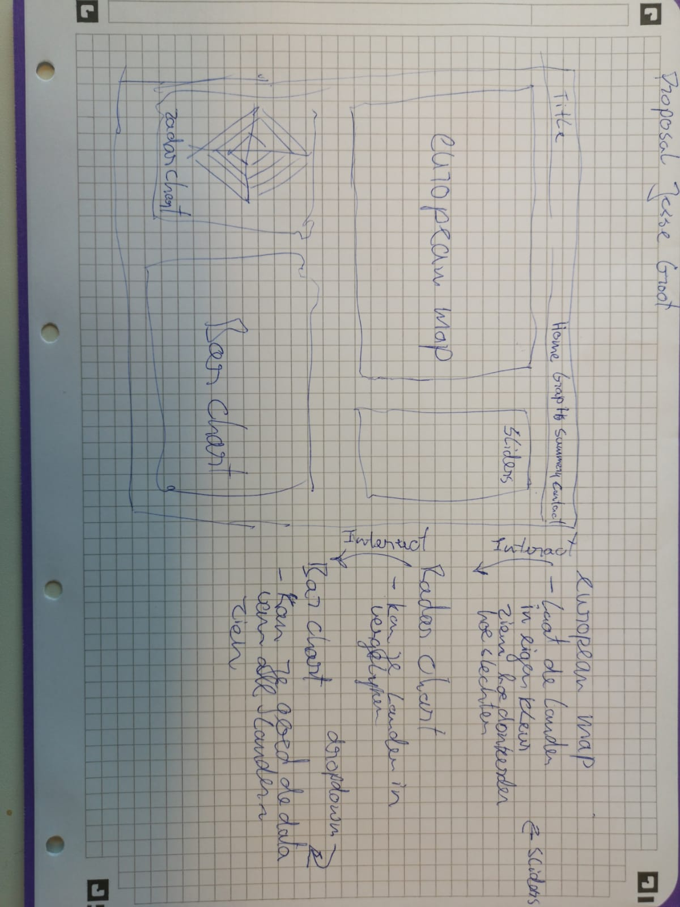

# Project

In this project we want the viewer to make his own bad country index. This will be done by
sliding the sliders. this causes the map to adjust and make a ranking on what you found
important. You can also click on the countries to compare the individual stats. The clicking
will load the data into the radar chart and there it will be easy to compare. You can also
click on the axis of the radar chart to watch all the data of this category in the bar
chart. you can order this ascending, descending or Alphabetical.

# Technical design

First the sliders, a empty world map, empty radar chart and a filled bar chart is created.
1) Through sliding the bars the world map is adjusted.
2) Trough clicking on the map the radar chart is adjusted.
3) Trough clicking on the axis of the radar chart the bar chart is adjusted.

Main.js contains: main():
- loads in the JSON with all the data.
- changes the JSON a little (key names).
- calls --> bar_radar_chart()
- calls --> european_map()
- calls --> sliders()

Radar_bar_chart.js contains bar_radar_chart()
- makes barchart
- makes empty radarchart.
- contains update function for barchard:
  - updates barchard.

Landmap.js contains european_map()
- makes the european map.
- contains radar_chart_data()
  - updates the radar chart with the given data from on click.

Sliders.js contains sliders()
  - adds four sliders to html
  - contains transitioncolor()
    - transitions the color of the map
    -  contains make_ranking()
      - makes ranking of the current sliders combination

CSS files:
CSS_File.css --> contains CSS for HTML page layout.
landmap.css --> contains CSS for the graphs.

# Challanges & Process

## Challanges:
My hardest challange was actually the making of the proposal. I had worked out a whole lot but that proposal got rejected so i had to start over. I found it really hard to make a good project cause i really wanted people could do something with it rather than just watch and don't care about it at all. I also ain't really  creative so this was kind of a big struggle.
Also the making of the right structure for my functions was not to easy. I ended up putting different functions in other functions so the function could be found. This wast the most beautiful since i wanted to have all the graphs in serperated maps. but if i wanted to do that i had to give loads with information to other functions and i believed it would only make it slower.
Also i changed the radar chart look. I decided to show a half moon radar chart since i hard only 4 data points and this way it looks far more clean.

## Acquired Skills
- A lot of D3 transition mechanisms. I learned a lot about how things are actually called.
- Javascript mechanisms, how the function structures worked and just over general scripts.
- D3 overal how to make graphs.

# Defend Decisions
Like I said this way it may looks a little less clean however I believe that it works faster this way and since the codes interact with each other at each javascript file it is not that uglier.

# Other Idears on the project
If more time i would have liked to:
- Sort bar chart on own Ranking
    but this was quite difficult since you can change the ranking at anny time and you had to update this graph by every little change. not all the countries have all the data annyways so you also have to keep this in mind.
- Make the data in the barchart lighten up from a country when you click on it.
    this would be more easy and made a huge difference observing data. 
